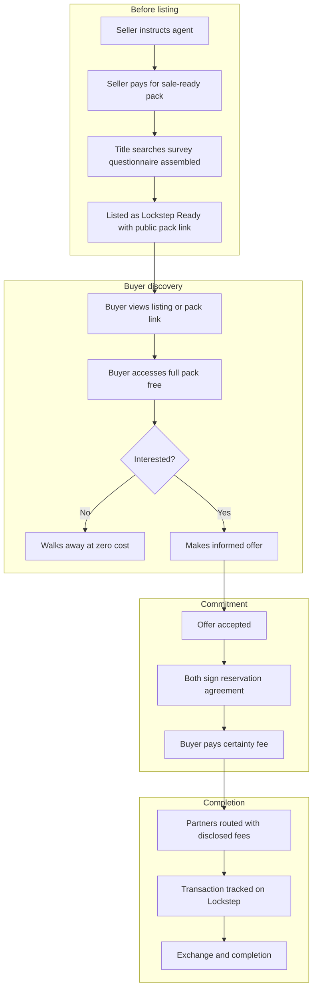
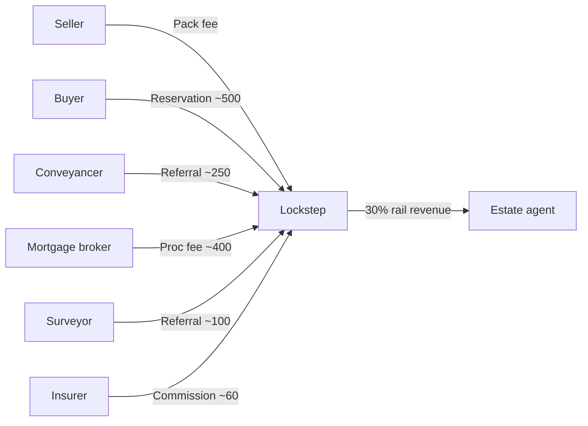
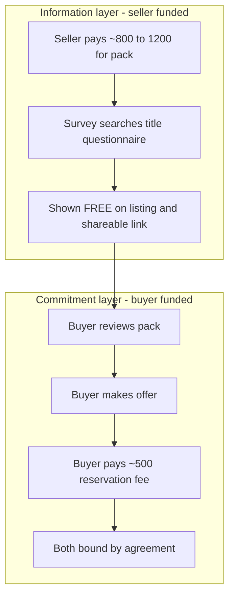

# Product and Mechanics

**TL;DR:** "Sold subject to contract" stops being a handshake and starts being a deal — because the pack is on the listing, both sides commit early, and someone runs the file to completion. Two layers for agents: a free listing badge (shop window) and opt-in completion rails (till).

---

## In one sentence

The pack is on the listing, both sides commit at offer, and Lockstep coordinates completion through disclosed partner rails — sold through agents, fees on the table.

---

## The product stack

**Sale-ready and secured** for England and Wales residential:

1. **Sale-ready pack** — Seller funds upfront: title, searches, property information questionnaire (TA6-style), independent survey with **buyer reliance**, leasehold disclosure where relevant
2. **Reservation agreement** — financial commitment at offer acceptance; buyer pays certainty fee (~**£500**)
3. **Completion rails** — conveyancing, mortgage, survey top-up, insurance through partners; one status board
4. **Transparent economics** — every referral fee shown before the consumer picks a partner

We are the **orchestrator**. Not a law firm. Not a survey shop. Not an instant buyer.

---

## Two layers for agents (shop window vs till)

| Layer | Agent cost | What it does | Analogy |
|-------|-----------|--------------|---------|
| **Lockstep Ready badge** | **£0** | Sale-ready pack on the listing; wins instructions at valuation | Shop window — pulls people in |
| **Completion rails** | Opt-in share only when used | Conveyancing, mortgage, survey, insurance routing after offer | Till — only rings when used |

The badge is the adoption hook. Rails are where unit economics live. Agents do not pay to switch on; they only share revenue on deals Lockstep coordinated.

---

## Who gets what

| Party | Value | Why they care |
|-------|-------|---------------|
| **Buyer** | Full pack before offer; harder to gazump; less **~£2.7k** burned on dead deals | Actually moves in |
| **Seller** | Committed buyer; faster exchange; price reflects reality upfront | Actually moves out |
| **Agent** | Commission protected; wins listings with badge; share of rails when used | Pipeline that closes |
| **Partners** | Warm, instructed, committed files | Customer acquisition cost cheaper than paid search |
| **Lockstep** | Reservation fee + disclosed rails | Margin on orchestration |

---

## Who pays for what

| When | Who pays | What |
|------|----------|------|
| Before listing | **Seller** | Pack and survey |
| On listing | — | Pack **free** to all viewers (public shareable link) |
| Before offer | — | Buyer reads; walks away for **£0** if no fit |
| After offer | **Buyer** | Reservation / certainty fee (~£500) |
| Through completion | Via partners | Conveyancing, mortgage, etc. — **fees disclosed** |

**Rule:** Nobody pays for air. Seller buys speed and certainty. Buyer only pays once they have seen the file and want in.

---

## End-to-end flow

---

## Money flow

Detail: [03-economics.md](03-economics.md).

---

## Information vs commitment (two separate payments)

Buyer never pays for information they reject. Bad survey results are priced in **before** offer, not discovered at month three.

---

## Reservation agreement — valid withdrawal

| Valid (no penalty) | Invalid (penalty may apply) |
|--------------------|----------------------------|
| Failed mortgage despite reasonable efforts | Cold feet / change of mind |
| Serious survey or title issue not in pack | Gazumping / accepting higher offer |
| Chain collapse (agreement **pauses**) | Gazundering without cause |
| Seller misrepresentation in pack | Unreasonable delay |

Enforcement: mutual commitment; adjudication; court recovery if needed ([Gazeal £35k case](https://thenegotiator.co.uk/news/regulation-law-news/buyer-who-withdrew-unreasonably-from-property-sale-to-pay-35000/)).

---

## Chain handling (beachhead + enticement)

Lockstep secures **individual buyer–seller pairs**. Full chain certainty needs multiple links on the platform — a later phase.

**Beachhead (chain-free and short-chain):** first-time buyers, new builds, probate and empty homes, sellers who will only accept chain-free buyers (**15%** of burned movers said they would — [Barclays](https://www.estateagenttoday.co.uk/breaking-news/2026/02/fall-throughs-cost-buyers-thousands-new-data/)).

**Chained deals — pause-not-penalise:** if an upstream link breaks, the reservation agreement **automatically pauses**. Neither buyer nor seller is punished for someone else's failure. Their seatbelt still works even if the car in front crashes. We never market a full-chain guarantee.

---

## Partner routing (default-path nudge)

When buyer or seller needs conveyancing, mortgage, or insurance:

1. Lockstep presents a **pre-selected panel partner** alongside a transparent side-by-side comparison of alternatives and what Lockstep earns from each
2. Consumer chooses — easy to accept the default, free to decline
3. Partner receives a qualified, committed lead
4. Agent sees status on the agent portal

Think **comparison site**, not coercion: the insurer pays the comparison site when you sign up; here, the conveyancer pays Lockstep when the file completes.

---

## Avoiding the Home Information Pack failure

The mandatory Home Information Pack scheme (2007–2010) failed because buyers did not trust seller-funded condition information and conveyancers re-ordered searches.

Lockstep differs on three mechanics (blind-assigned referee, not the home team's friend):

- **Random surveyor panel assignment** — seller cannot choose the surveyor
- **Buyer-assignable reliance** on the report, with professional-indemnity cover
- **Transferable searches** where lenders and panel conveyancers allow

---

## Brand line

**Fees on the table.** Referrals disclosed at introduction. In a market built on quiet kickbacks, that is the wedge.

---

## Today vs Lockstep

| Step | Today | Lockstep |
|------|-------|----------|
| Information | After offer; **≤2%** felt sufficient pre-offer | **Before offer**; free via listing and shareable link |
| Survey | Buyer pays after offer; **27.3%** pull out after bad survey | Seller-funded; buyer-reliant; seen upfront |
| Commitment | Non-binding until exchange (~**104 days**) | Reservation agreement at offer acceptance |
| Coordination | Fragmented across six parties | Single tracker + routed partners |
| Fall-through | **~29.8%** (2024) | Target **<10%** |

---

**Why it matters:** The product is not novel in concept — Scotland and Redbrik proved the sequence. Lockstep's job is to make it national, agent-distributed, and trust-mechanically sound where Home Information Packs failed.
