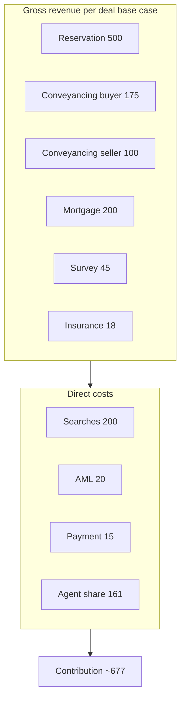

# Economics

**TL;DR:** Lockstep earns like a comparison site, not a software subscription — reservation fee from the buyer plus referral revenue from partners who pay for committed leads. Profitability is a volume and attach-rate game; agents share rail revenue as an insurance premium on commission already earned.

> **Model, not forecast.** Attach rates are assumptions to validate in Phase 0. Referral ranges are sourced; editable inputs in [../financials/unit-economics.csv](../financials/unit-economics.csv).

---

## Revenue logic

Think **broker plus marketplace**, not software seat fees:

- **Partners** pay for committed files (estate agents already receive **£250–£400** for conveyancing introductions — [Legal Services Board 2010](https://www.legalservicesboard.org.uk/news_publications/latest_news/pdf/cra_impact_of_referral_arrangements_final_14may2010(STC).pdf))
- **Buyer** pays once for reservation — skin in the game (~**£500**, just under Redbrik's proven **£595** anchor)
- **Seller** funds the pack — that is the listing hook

We disclose every pound. That is the brand, not a footnote.

---

## Who pays Lockstep

| Payer | What for | Typical amount | When |
|-------|----------|----------------|------|
| **Buyer** | Reservation / certainty fee | **~£500** | At offer acceptance |
| **Conveyancer** | Buyer-side referral | **~£250** | On completion |
| **Conveyancer** | Seller-side referral | **~£250** | On completion |
| **Mortgage broker** | Procuration fee (from lender) | **~£300–£600** | On mortgage completion |
| **Surveyor** | Survey referral | **~£50–£150** | On survey instructed |
| **Insurer** | Policy commission | **~£30–£80** | On policy sale |
| **Seller** | Sale-ready pack | **~£800–£1,200** | Before listing |

Seller pack fee may be bundled by the agent. Buyer reservation fee may partially cover search costs (Redbrik model).

---

## Who does NOT pay Lockstep

| Party | Relationship |
|-------|--------------|
| **Estate agent** | Does not pay — **receives share of referral revenue** as channel incentive |
| **Seller** (commitment layer) | Does not pay reservation fee — buyer does |

---

## Agent economics — commission protection, not referral capture

Roughly **a third** of agreed sales collapse. Each fall-through costs the agency **~£4,123** plus the lost **£3,000–£6,000** commission on a typical **£300k** sale.

| Item | Value |
|------|-------|
| Commission on **£300k** sale | **~£3,000–£6,000** |
| Cost per fall-through to agency | **~£4,123** |
| Conveyancing referral (today, agent keeps 100%) | **~£200–£400** |

**Pitch to agents:** Lockstep protects the commission you have already earned. The rail share is an **insurance premium** on that commission — not a tax on new income. One saved deal pays for months of sharing.

| Agent tier | Share of Lockstep referral revenue | Notes |
|------------|-----------------------------------|-------|
| Standard partner | **30%** | Does not include buyer reservation fee |
| **Founding partner** (first ~5 branches) | **40%** | First 24 months; co-naming and product input |

Founding partners are the house band, not session musicians — they co-own the playbook, not just run it.

---

## Why service partners pay

Partners pay because Lockstep is **customer acquisition** — like a comparison site handing an insurer a ready-to-buy customer.

| Partner | They earn per deal | Why referral fee to Lockstep is worth it |
|---------|-------------------|------------------------------------------|
| Conveyancer | **£1,000–£2,000** legal fee | Cheaper than paid search; customer already committed |
| Mortgage broker | **£300–£1,000+** procuration fee | Buyer needs mortgage and has signed reservation |
| Surveyor | **£400–£1,500** | Steady pipeline; survey often already done |
| Insurer | Premium | Standard distribution commission |

Files complete at higher rates than the open market (~**70%** baseline vs Lockstep target **85%+**), so partners waste less work on collapsed files.

---

## Multi-rail attach — default-path nudge (1A)

Gazeal survived 16 years on primarily **one rail** (~£500 reservation) with **6 staff** and turnover **<£1M** ([Endole](https://open.endole.co.uk/insight/company/06772691-gazeal-limited)). Lockstep needs **multi-rail attach** (~£538 referral revenue at base attach) — not reservation fee alone.

**Mitigation:** pre-selected panel partner shown alongside a transparent side-by-side comparison; easy to accept, free to decline. Protects attach rate without coercion or compliance risk. Pack structured for panel conveyancer efficiency.

---

## Transparent-cut positioning

Lockstep **discloses every referral fee** at point of introduction:

> "If you use our recommended conveyancer, Lockstep receives £250. Here are three alternatives and what we earn from each."

- **Legally required** under Consumer Protection Regulations and National Trading Standards Estate and Letting Agency Team guidance
- **Brand differentiator** — honesty in a market defined by hidden kickbacks

---

## Per completed deal — base case (illustrative)

### Revenue (gross)

| Line | Full value | Attach rate | Weighted revenue |
|------|------------|-------------|------------------|
| Reservation fee (buyer) | £500 | 100% | **£500** |
| Conveyancing referral (buyer) | £250 | 70% | **£175** |
| Conveyancing referral (seller) | £250 | 40% | **£100** |
| Mortgage referral | £400 | 50% | **£200** |
| Survey referral | £100 | 45% | **£45** |
| Insurance commission | £60 | 30% | **£18** |
| **Total gross revenue** | | | **£1,038** |

### Direct costs

| Line | Amount |
|------|--------|
| Searches + pack assembly | £200 |
| Identity verification / anti-money-laundering | £20 |
| Payment processing | £15 |
| Agent share (30% of **£538** rail revenue) | £161 |
| **Total direct costs** | **£396** |

### Contribution margin

**£1,038 − £396 = £642** (rounded **~£677** where reservation net differs slightly). This is contribution per completed deal before operating costs.

Chart: `../charts/06-revenue-stack-base.png`

---

## Scenarios

| Scenario | Attach assumptions | **Contribution** |
|----------|-------------------|------------------|
| **Conservative** | Lower attach (50% conv buyer, 30% mortgage) | **~£487** |
| **Base** | As table above | **~£642–677** |
| **Optimistic** | Higher attach (85% conv buyer, 70% mortgage) | **~£859** |

---

## Started vs completed

| Parameter | Value |
|-----------|-------|
| Market baseline completion | ~70% |
| Lockstep target completion | **85%** |
| Partial recovery on failed deals | ~£250 avg |

**Blended contribution per started deal (base):** (£677 × 0.85) + (£250 × 0.15) ≈ **£612**

---

## Sensitivity

| Variable | Downside | Upside |
|----------|----------|--------|
| Mortgage attach 50% → 20% | −£120/deal | 50% → 70%: +£80/deal |
| Agent share 30% → 50% | −£108/deal | 30% → 20%: +£54/deal |
| Completion rate 85% → 70% | Blended −~£90/started | 85% → 92%: +£50/started |
| Consumer customer acquisition cost | Forced business-to-consumer ads (~£50/click) | Agent business-to-business-to-consumer: ~£0 |

**Critical insight:** Profitability is a **volume plus attach rate** game, not a pricing game.

---

## What Lockstep is NOT

| Model | Why not |
|-------|---------|
| Hidden kickbacks | Illegal to conceal; brand risk |
| Pure flat-fee zero referrals | Lower margin; "too cheap" distrust |
| Employed conveyancers | Purplebricks margin collapse |
| Instant buyer / buy houses | Upstix **-£7.25M** pre-tax |

---

## Regulatory posture (summary)

Lockstep operates as introducer and orchestrator: referral fees disclosed; mortgage and insurance via Financial Conduct Authority appointed representative or introducer-only; does not conduct reserved legal activities; anti-money-laundering obligations when handling identity and payments.

Detail: [04-competition-and-risk.md](04-competition-and-risk.md).

---

**Why it matters:** Unit economics only work with multi-rail attach and agent channel distribution at near-zero customer acquisition cost. Phase 0 must measure real attach rates before we scale build or spend.
